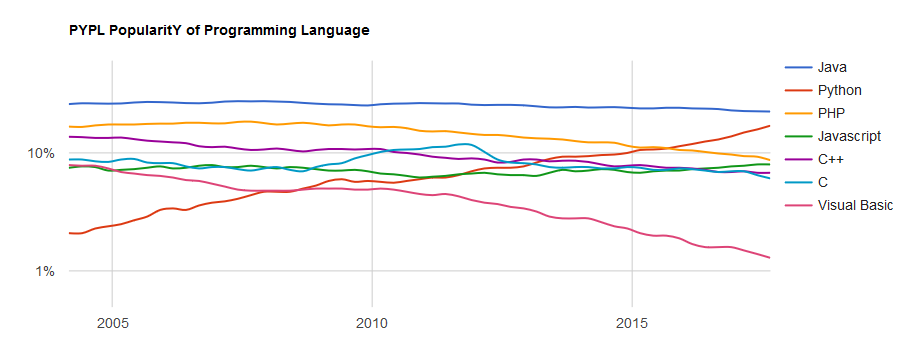
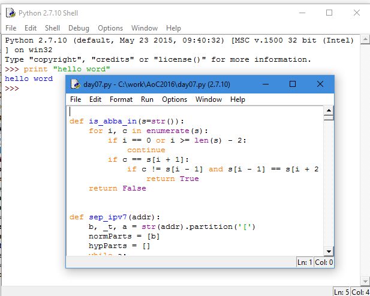
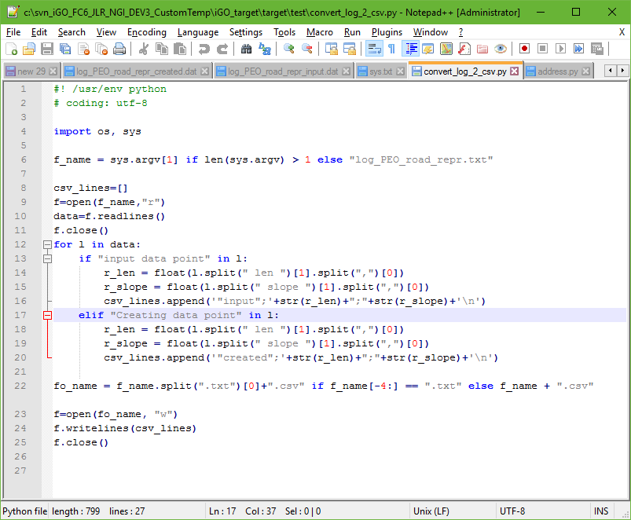
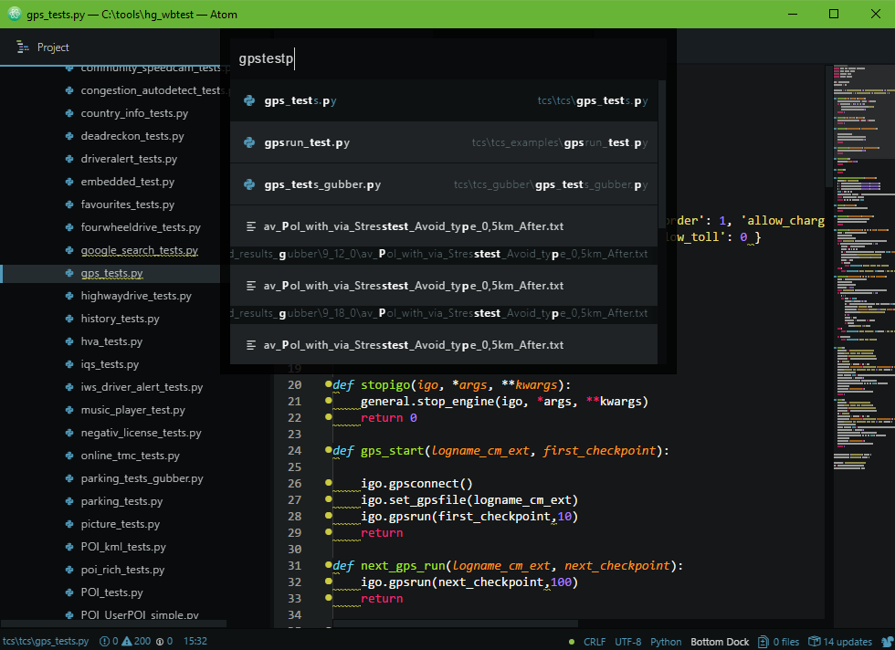
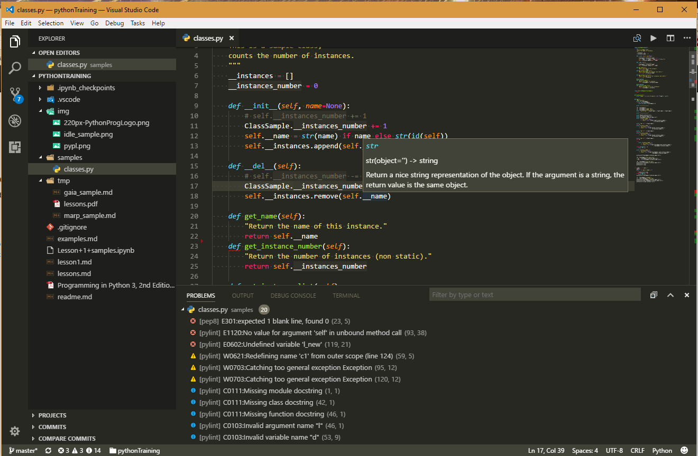
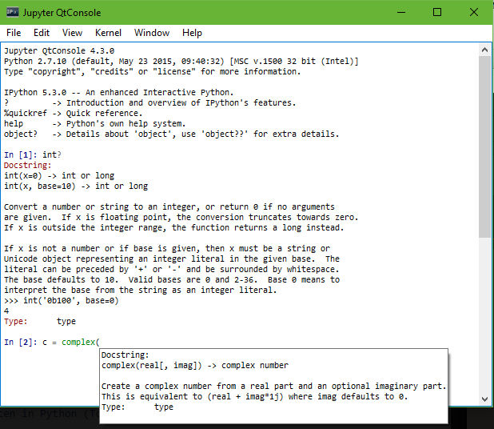

<!-- $theme: gaia -->
<!-- page_number: false -->
<!-- footer: Péter Handbauer, version: 10/04 -->
<!-- $size: a1 -->


Python Tréning "2"
==============================

#### (Mostly) advanced

## I. Python gyorstalpaló

---
<!-- footer: Python tréning "2", I. Python gyorstalpaló -->

## Story so far

 - script nyelvi dolgok, típusgyengeség, alap szintaxis
 - háttér, nyelvi evolúció, interpreter
 - feljesztő eszközök, ajánlott IDE-k Pythonhoz, debugging, project Pythonban
 - hasznos `__builtin__` nyelvi eszközök (`dir()`, `help()`, `type(t)`, `any()`...) és lehetőségek (egysoros `(if else)`...)
 - adatszerkezet alapok, konverziók, tuple csomagolás és swap

---

## Mi az a script nyelv?

TODO

---
### Script vs program

```python
# powerof.py
# Python 2.7
import sys
if len(sys.argv) == 3:
    print float(sys.argv[1]) * float(sys.argv[2])
else:
    print "Run with two params!"
```
 - azonnal futtatható:
```bash
$ python powerof.py 3.0 4
81.0
$ python powerof.py 5
Run with two params!
```
---
### Script vs program

```python
# powerof.py
# Python 2.7
import sys

def main():
    "The main function."
    if len(sys.argv) == 3:
        print float(sys.argv[1]) * float(sys.argv[2])
    else:
        print_help()

def print_help():
    "Print help message to console."
    print "Run with two params!"

if __name__ == "__main__":
    main()
```

---
### Erős és gyenge típusosság

 - Gyengén típusos jegyek

```python
# Python2.7
from math import sqrt

i = 2 + 2  # do something difficult
print type(i), i
i = sqrt(i)
print type(i), i
```

---
### Erős és gyenge típusosság

 - Erősen típusos jegyek
    - létezik `type()`
 - De!

```python
i = str(i)
print type(i), i
i = [i]
print type(i), i
```

 - A Python **dinamikusan típusos** nyelv!
    - plusz _duck typing_ (később)

---
### Scriptnyelv: célorientált

```python
# Python 2.7
import urllib2
response = urllib2.urlopen('http://python.org/')
print response.read()
```

 - Cserébe: sebesség :(
 - Importálható library kódja lehet pl. C++-ban is.
 - Egyéb lehetőségek: GC, JIT (pl. PyPy, később)

---

## Python áttekintés

 - Guido van Rossum, 1991
 - Python Software Foundation, python.org
 - Stabil release (2017.10.04-én):
    - 3.6.3 / 3 October 2017
    - 2.7.14 / 16 September 2017
 - hivatalos paradigma:
    _multi-paradigm: object-oriented, imperative, functional, procedural, reflective_
 - név eredete: Monty Python :smiley:

---

## Python áttekintés

 - Implementációk:
 CPython, IronPython, Jython, MicroPython, Numba, PyPy, Stackless Python ...

 - Platform, implementáció függő különbségek:
```python
>>> # IronPython with .NET
>>> from System.Collections import BitArray
>>> ba = BitArray(5)
>>> ba.Set(0, True) # call the Set method
>>> ba[0]
True
```

---
### Történet

- 1994:  1.0
   - funkcionális eszközök (`map()`, `reduce()`, `filter()`)
- 2000: Python 2.0
   - list comprehensions, garbage collection
   - Python 2.2: típus egységesítés, generators
   - ... - 2020: **Python 2.7.x**
- 2008 - ...: Python 3.x.x
   - *broken backward compatibility!*

---
### Történet


https://pypl.github.io/PYPL.html

---

## Fejlesztői környezetek

---
### _Bármely_ text editor
# 

---
### IDLE

- default interpreter shell & file editor 
- basic debugger
- written in Python (Tcl/Tk), "multiplatform"

---
### Sublime / Atom
# 

---
### Visual Studio Code
# 

---
### PyCharm
# 

---
## Interactive Shell
#### IPython / Jupyter



---
## 