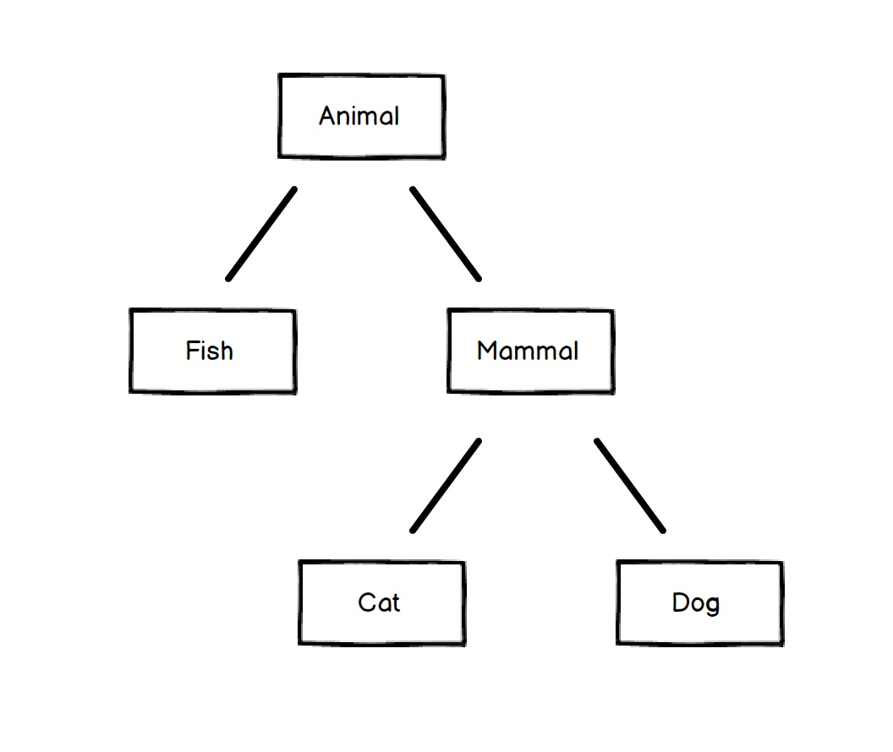

<!-- $theme: gaia -->
<!-- page_number: false -->
<!-- footer: Péter Handbauer, version: 11/15 -->
<!-- $size: a1 -->


Python Tréning "2"
==============================

#### (Mostly) advanced

## V. Osztályok és objektumok

---
<!-- footer: Python tréning "2", V. Osztályok és objektumok -->
## Objektumok és OOP

 - Az **objektum** elkülöníthető entitás, ami:
    - csoportosíthat adatokat
    - tartalmazhat futtatható kódot
    - többször felhasználható, példányosítható
 - Az Object Oriented Programming:
    - objektumokra támaszkodó programozási mód
    - hierarchikus megközelítés
    - újrafelhasználhatóság
    - karbantarthatóság

---
## Objektumok Pythonban

http://www.diveintopython.net/getting_to_know_python/everything_is_an_object.html
> Still, this begs the question. What is an object? Different programming languages define “object” in different ways. In some, it means that all objects must have attributes and methods; in others, it means that all objects are subclassable. In Python, the definition is looser; some objects have neither attributes nor methods, and not all objects are subclassable. But everything is an object in the sense that it can be assigned to a variable or passed as an argument to a function.

---

## Objektumok Pythonban

 - Python: _"Everything is object!"_
    - minden `class`
    - adatszerkezetek
    - importált library-k
    - változók (!)
    - függvények (!)
 - értékül adható, referálható
 - lehetnek metódusai, van saját dokumentációja

---

## Objektumok Pythonban

> This is so important that I'm going to repeat it in case you missed it the first few times: everything in Python is an object. Strings are objects. Lists are objects. Functions are objects. Even modules are objects.

```python
import urllib2
op = urllib2.urlopen

sample_page = op("https://xkcd.com/353/")

# OR:
sample_page.name = "An XKCD site."
op.get_42 = lambda : 42
op.get_42()   # it works!
```
---

## Osztályok Pythonban

 - `class` kulcsszóval definiálható
    - (vagy _esetleg_ `type(,,)` segítségével)

```bash
class MyClass:
    """The documentation string"""
    i = 12345   # a class variable

    def simpleMethod(self):
        print 'hello world'
        return self.i
        
    def otherThingToDo(self, param):
    	"""Function doc string."""
    	return self.i + param
```
---

## Osztályok Pythonban

 - példányosítható
 - referálható
```python
c1 = MyClass()

a = c1.simpleMethod()
help(c1.otherThingToDo)

c2 = MyClass()
c2_ref = c2

print id(c1), id(c2), id(c2_ref)

```

---

## Osztályok Pythonban

 - alapvetően minden eleme _publikus_
 - ami publikus, az módosítható is

```python
print c1.i
c1.i = lambda a, b: a*b
print c1.i(2, 4)
```
 - _privát_ jelzés: név elé írt `__`
```python
class Sample:
    __i = 1

c = Sample()
print c.__i   # throw an error!
```

---

## Osztályok Pythonban

 - osztály member függvények (metódusok)
 - első paraméter a `self`,  maga az osztály _példánya_
```bash
class SampleClass:
    __privateValue = 0
    name = "nothing"
    def countCalls(self):
    	self.__privateValue += 1
        print "Called " + self.__privateValue + " times."
    def call_me(self, s):
    	self.name = str(s)
    def get_name(self):
    	name = "I'm %s the %dth!"%(self.name,
                                   self.__privateValue)
    	return name
```
---

## Konstruktor, osztály változók

 - `__init__` (és `__new__`) függvény a **konstruktor**: minden példányosításkor lefut
 - Az osztály változók a példányok között _közösek_.
 - Konstruktorban, metódusban (vagy kívülről) deklarált változók _példányonként sajátok_!

```bash
class Sample:
    ourName = "Sample"
    def __init__(self, myName = "default name"):
        self.__myName = myName
    def get_name(self):
        return self.__myName
        
c1 = Sample("Adam")   
```
---

## Konstruktor, közös és egyedi változók

```python
c2 = Sample()
c3 = Sample("Eva")

# different names for everyone:
print [i.get_name() for i in (c1, c2, c3)]
## ["Adam", "default name", "Eva"]

# but class vars shared:
print c1.ourName, c2.ourName, c3.ourName, Sample.ourName
## all is "Sample" !

# be careful!
Sample.ourName = "our new name"  # change in all!
c3.ourName = "my renegate name"  # NO, that is redefinition!
print c1.ourName, c2.ourName, c3.ourName, Sample.ourName
# our new name our new name my renegate name our new name
```
---

## Öröklés

 

---

## Öröklés Pythonban

```bash
class Base:
    a = 1

class Derived(Base):
    def getFromBase(self):
        return self.a
```
 - **old-style class** és **new-style class**: `object`-ből származás

```bash
class ThisIsNewStyleClass(object):
    # already has many useful methods!
    
```

---
## Többszörös öröklés

 - van, de általában kerülendő:
```bash
class Car(Vehicle, Product):
    # methods and vars from both Vehicle and Product
```
## Öröklés, attribútum ellenőrzés
 - ős lekérése: `super(type)`, `super(type, instance)`
 - a példány őseinek ellenőrzése: `isinstance(inst, (C1, C2))`
 - member ellenőrzés: `hasattr(instance, "attribute_name")`
 - magát a membert: `getattr(something_object, "attr_name")`

---

# ...

---

## Operator overloading

 - Az operátorok és sok függvény is valójában egy védett metódust hív.
Csak néhány példa:
 - Számokra `<`, `>`, `==`, `cmp()`: `.__cmp__(self, x)`
 - Collectionökre `len()`: `.__len__(self)`
    - `[]`: `.__getitem__(self, i)`
    - `[::]`: `.__getslice__(self, i,j,k)`
 - Konverziók is sokszor: `str()`, `repr()`: `.__str__(self)`, `.__repr__(self)`

---

## Operator overloading
 - `+`: `.__add__(self, x)`; `*`: `__mul__(self, x)`
 - hashing (pl. dict-ben kulcsokhoz): `.__hash__(self)`
 - string compare: `.__lt__(self, x)`, `.__le__(self, x)`, `.__eq__(self, x)`, `.__ge__(self, x)`, `.__gt__(self, x)`

 - ha valami _iterable_ kell legyen: `.__iter__(self)`, `.next()`

 - gyakorlásra:
https://www.hackerrank.com/challenges/class-1-dealing-with-complex-numbers/problem

---

## Nem érdemes kapkodni!

 - Vannak egyszerűbb kész módszerek is, pl. feltételes sorbarendezésre (operátor felülírás helyett):
```python
from random import randint

class Point():
    def __init__(self, x=0, y=0):
        self.x, self.y = x, y

point_list = [ Point(randint(-10, 10), randint(-10, 10))
               for i in xrange(1000) ]

# sort with x:
point_list.sort(key=lambda p: p.x)

```

---

## Hogyan tovább?

 - Sok-sok gyakorlás példákkal:
https://www.hackerrank.com/domains/python/py-introduction

 - Ajánlott összefoglaló hasznos dolgokra:
http://book.pythontips.com/en/latest/index.html

 - Don't forget to import this! :)

---

## Jó készülést!

## Kérdések?